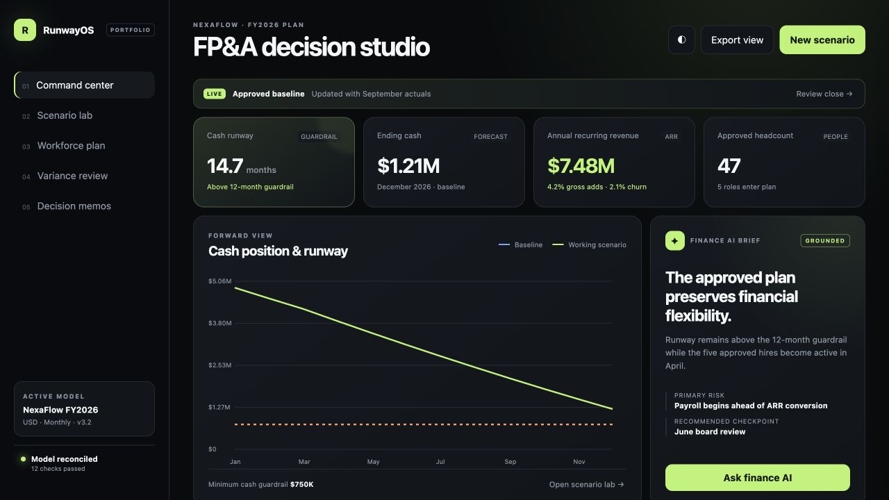

# RunwayOS

## AI-Powered FP&A Cash Runway & Workforce Planning Simulator

RunwayOS is an interactive FP&A portfolio application for a fictional B2B SaaS company. It helps leadership test hiring, growth and churn decisions against cash-runway and minimum-liquidity guardrails.



> **Portfolio disclosure:** NexaFlow and every financial record in this repository are synthetic. The project demonstrates analytical capabilities and does not claim realized results for a real business.

### Why this project exists

Finance teams often spend significant time reconciling fragmented spreadsheets before they can answer a management question. RunwayOS demonstrates a governed alternative: business assumptions enter a deterministic financial model, scenarios remain separate from the approved baseline, and AI explains only verified outputs.

### Product surfaces

- **Command center:** cash runway, ending cash, ARR, headcount and plan-health guardrails
- **Scenario lab:** hiring, salary, revenue growth, churn and timing controls with baseline comparison
- **AI scenario builder:** converts supported natural-language decisions into governed inputs
- **Workforce plan:** role-level timing, priority, approval status and fully loaded cost
- **Variance review:** budget-versus-actual favorability, waterfall and deterministic drivers
- **Decision memos:** model-versioned recommendations with whitelisted evidence IDs
- **Exports:** scenario snapshots, variance CSV and management memo

### Architecture

```text
Governed assumptions
        ↓
Deterministic FP&A engine
        ↓
P&L · cash · runway · workforce scenarios
        ↓
Auditable AI narrative and decision memo
```

The AI layer never calculates financial results. It converts supported natural-language requests into governed scenario inputs and explains outputs produced by the tested finance engine.

### Repository structure

```text
├── index.html                 Main application shell
├── styles.css                Responsive product design system
├── app.js                    User interactions and presentation logic
├── finance.mjs               Deterministic FP&A calculations
├── browser-app.js            Browser-ready application bundle
├── RunwayOS-Standalone.html  Single-file offline demo
├── data/                     Synthetic assumptions and variance data
├── docs/                     Finance methodology and interview guide
├── tests/                    Financial reconciliation and product tests
└── .github/workflows/        Automated validation and Pages deployment
```

### Run locally

Requires Node.js 18 or newer.

```bash
npm run dev
```

Then open `http://127.0.0.1:4173`.

Alternatively, serve the standalone file:

```bash
python3 -m http.server 8080
```

Then open `http://localhost:8080/RunwayOS-Standalone.html`.

### Validate

```bash
npm test
npm run build
```

The suite checks the cash roll-forward, MRR bridge, scenario directionality, variance favorability, natural-language assumption mapping, evidence whitelisting and static product integrity.

### Deploy with GitHub Pages

1. Create an empty GitHub repository and upload this project.
2. Push the code to the `main` branch.
3. In repository **Settings → Pages**, select **GitHub Actions** as the source.
4. Run the included **Test and deploy RunwayOS** workflow if it does not begin automatically.

The workflow runs the tests, creates the static build and publishes the `dist` folder.

### Portfolio integrity

NexaFlow and all data are synthetic. The application demonstrates modeled capabilities and does not claim realized savings, forecast accuracy, or work performed for a real company. The AI experience is intentionally deterministic and offline-ready so interview demonstrations never depend on an external API.

See [docs/FINANCE_MODEL.md](docs/FINANCE_MODEL.md) for calculations and controls and [docs/INTERVIEW_GUIDE.md](docs/INTERVIEW_GUIDE.md) for the interview narrative.
# ai-fpa-runway-workforce-planner
# ai-fpa-runway-workforce-planner
# ai-fpa-runway-workforce-planner
